<h1 align="center">
  
  Sagnik Kundu
</h1>

  

<h3 align="center">AI & Data Science Enthusiast · Machine Learning · Data Analytics · FinTech</h3>

  
  
  
  

---

## 🧑‍💻 About Me

- 🎓 B.Tech in Computer Science (AI & Data Science) at **SASTRA Deemed University** (2024–2028)
- 🤖 I build machine-learning models and data pipelines, and I like projects that simulate the real world
- 📊 I enjoy digging into large datasets to find trends, patterns and stories
- 💹 Especially interested where **AI meets finance**
- ☁️ Currently exploring **cloud computing**, next on my learning list
- 🤝 **Open to AI, ML and Data Science roles and internships**

---

## 🚀 Featured Projects

### 💹 [FinSim](https://github.com/sagnik5549/FinSim)

**Financial Decision Simulation Platform.** A full-stack game where you manage an investment fund on a simulated market under risk limits, time pressure and surprise events.

- ML model that classifies player behaviour (conservative → speculative), with a rule-based fallback
- Adaptive "director" that tunes market events based on gameplay
- Multi-factor market simulation with regimes, sectors and news events

`Python` `Scikit-learn` `XGBoost` `FastAPI` `React` `PostgreSQL` `Docker`

### 📊 [Global Market Analysis (2000–2026)](https://github.com/sagnik5549/Market_Analysis_2000_Present)

**26 years of markets, decoded.** Analysed **187,611+** records across stocks, commodities, currencies and crypto to uncover long-term trends and volatility patterns.

- Compared asset behaviour during the Dot-Com Crash, 2008 Financial Crisis and COVID-19
- Exploratory data analysis and visualisation of shifts in performance and trading activity

`Python` `Pandas` `NumPy` `Matplotlib` `Seaborn` `Jupyter`

### 🔐 [Elliptic Curve Cryptography in C](https://github.com/sagnik5549/Elliptic-Curve-Cryptography-ECC-in-C)

**ECC built from scratch.** Finite-field arithmetic, point addition and doubling, scalar multiplication, key generation, ECDH key exchange, encryption/decryption and curve visualisation.

`C` `GMP` `Python`

### 🧩 [KDS Hackathon 2026](https://github.com/sagnik5549/kds_hackathon_2026)

**Backstory Consistency Verification System.** Checks whether claims in a character's backstory are supported or contradicted by the story itself.

`Python`

---

## 🛠️ Tech Stack

  

**🧠 Machine Learning & Data Science**

**💻 Languages**

**🗄️ Databases & Backend**

**🔧 Tools**

**☁️ Currently Learning**

---

## 🏆 Certifications & Activities

| | | |
|:-:|---|---|
| 🎓 | **Machine Learning Specialization** by Andrew Ng | 2026 |
| 📜 | **IBM Data Science Professional Certificate** | 2025 |
| 💻 | Member, **ACE – Competitive Programming Cluster**, SASTRA | 2026 – Present |

---

  <b>💬 Let's connect! I'm always up for conversations about AI, data and finance.</b>

